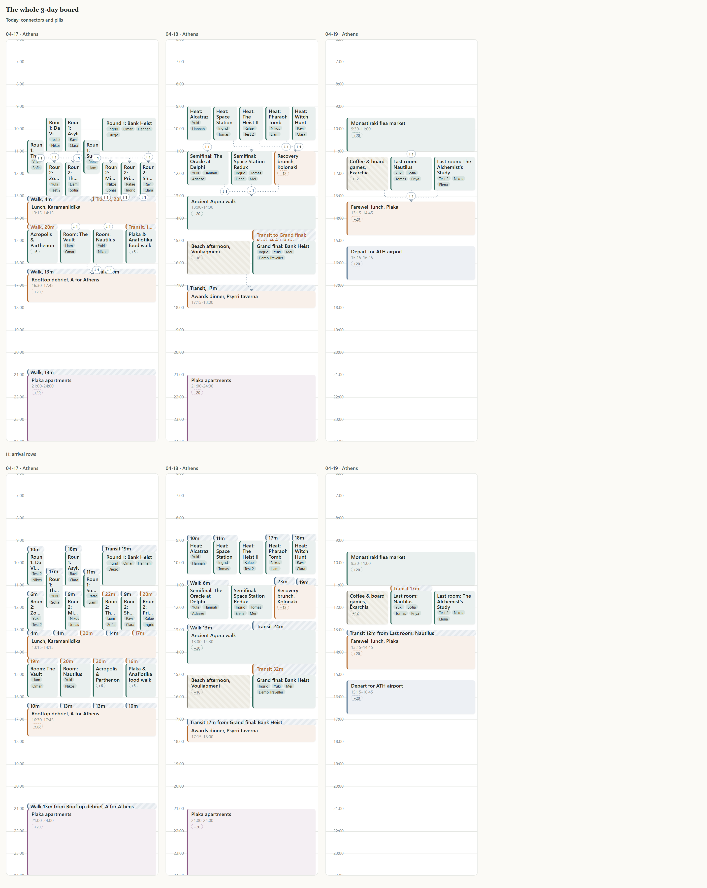
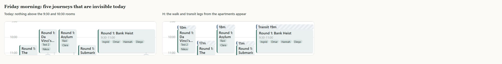
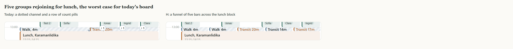
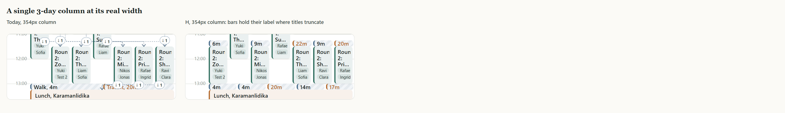
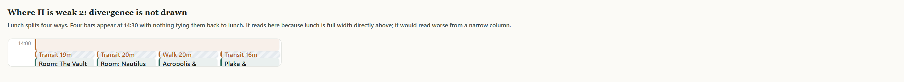
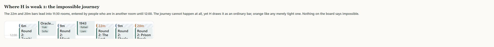

# How the board should draw travel: the decision

Written 13 Sep 2026. Supersedes the conclusion of `travel-visualisation.md`,
which surveyed eight options. That survey still stands as the record of what was
considered and why most of it was rejected. This document argues one case.

Everything here is measured or rendered from the real Athens trip. The figures
go through the real layout engine with the real CSS at the real column widths,
so they are comparable to what is on screen today.

---

## The decision

**Anchor every journey to the event it leads into, and delete the connector
system.** Then add hover-to-trace as a separate change.

I went into the edge-case review expecting to soften this. The evidence pushed
the other way, and two of my own objections turned out to be wrong.

---

## 1. What the board costs today

Friday 17 April is the worst day in the trip: 17 events, 24 journeys, the group
splitting five ways twice and rejoining twice.

| Day | Events | Journeys | Drawn as blocks | Connectors | Pills | **Total marks** |
|---|---|---|---|---|---|---|
| Fri 17 | 17 | 24 | 7 | 16 | 12 | **35** |
| Sat 18 | 13 | 11 | 2 | 9 | 5 | **16** |
| Sun 19 | 6 | 2 | 0 | 4 | 2 | **6** |

Thirty-five marks, and only 7 of them say anything. A connector says "someone
moved". A pill says "someone moved, and there is something here to click".
Neither says how long, by what mode, or whether it fits. Only a block does that.

The board spends most of its ink on its least informative mark.

### Why so few journeys become blocks

`layoutBoard` tries every journey as a block, then drops any whose middle does
not fall under both events it joins. On Friday that rejects 17 of 24.

This is structural, not a tuning problem. A journey's block is placed by the
same packer that places events, and the packer puts it wherever a column happens
to be free. It has no reason to put it under either endpoint. The board asks a
question it never tried to make true, then draws a line to apologise.

---

## 2. The proposal, in one rule

A journey is drawn as a block in the column of the event it **arrives at**,
sitting directly on top of that event. Where several journeys arrive at the same
event they share that event's width, ordered left to right by the column they
came from.

Journeys stop being packed at all, so events lay out exactly as if journeys did
not exist, which is the widest they can ever be.

Containment stops being a test and becomes a guarantee. There is nothing left
for a connector to explain, so there are no connectors, no pills, no arrowheads,
and nothing overlapping anything.

---

## 3. Why this is the right rule

### It is the rule the data model already uses

`placeLeg` (`packages/core/src/travel.ts:214`) anchors every journey to its
arrival in time, and says why:

> the fixed point is the thing you are trying not to be late for: a table booked
> at seven means leaving at half six, not arriving whenever an hour after the
> last stop happens to fall.

A journey's `endMin` is *always* its arrival's start. The core already decided
journeys belong to their arrivals. Only the drawing disagrees. This is not a new
convention to learn, it is the removal of a contradiction.

### It draws nine journeys that are invisible today

9 of the 37 journeys across the three days have no departure event on their day.
All nine are the same shape: leaving the lodging in the morning, where the
departure is the previous night's stay or, on the first morning, nothing at all.

Today's board needs both endpoints, so **all nine are drawn nowhere**.

Across all 37 journeys, the arrival is never the missing end. Anchoring to the
arrival is therefore not just the meaningful choice, it is the robust one.

### The case where today's board is worst becomes the case it draws best

Five groups rejoining for lunch is where the current design collapses: a dotted
channel running the width of the day and a row of count pills that reads as a
row of buttons.

The same moment becomes a funnel of five bars across the lunch block, each
naming its mode and duration, with the two that do not fit already orange.

---

## 4. The objection I got wrong

My first report said the headline risk was fans: several journeys sharing one
event's width would crush the bars into illegibility. Measured across all bars
in both views:

| | narrowest | median | widest |
|---|---|---|---|
| Day view | 76px | 108px | 556px |
| 3-day view | **46px** | 66px | 348px |

The 46px bars are **not** fans. They are fan-of-1 morning legs in single-width
columns. Shared bars measured 46px to 84px, so a fan is never the narrowest
thing on the board.

The reason is that the fan is self-correcting: many arrivals means many people
means a whole-group event, and a whole-group event is full width. Five journeys
into lunch is 348px split five ways, not 46px split five ways.

The real floor is one column, which is exactly the width of the event
underneath. **H never makes a bar narrower than the block it annotates.**

At 46px the bar still reads "18m" while the event title beneath it has already
degraded to "Roun 2: Zo...". The travel mark survives narrowness better than the
thing it is attached to.

---

## 5. Where it is genuinely weak

### Divergence is not drawn

The rule funnels well and splits not at all. Lunch scatters four ways and the
four bars simply appear an hour later with nothing tying them back.

It reads here because lunch is full width directly above. It would read worse
from a narrow column. In this trip **exactly one event sends people to two or
more places**, so the cost is small today, but this is the one thing the old
arrows did that the new rule does not, and it is the reason for the follow-up in
section 8.

### The impossible journey looks ordinary

Two Friday journeys have a negative gap: the departure event ends at 12:00 and
the arrival starts at 11:30, so someone is booked in two overlapping rooms and
the journey cannot happen at all.

The 22m and 20m bars are drawn as ordinary bars, tinted orange like any merely
tight journey. Nothing says impossible. That is a scheduling conflict wearing a
drawing problem's clothes, and today's `↓1` pill is no more honest about it.
Worth a real conflict marker, separately from this change.

### Two fears that turned out not to exist

- **Bars overflowing into the block above.** `placeLeg` already clamps a journey
  that does not fit into its gap and flags it `tight`. 10 of 37 are tight; they
  fill their gap in orange and cannot spill.
- **Hidden waiting time.** A journey always ends exactly when its arrival
  begins, by construction, so bottom-anchoring a bar to the event start cannot
  misreport anything.

---

## 6. Why not the alternatives

Full reasoning is in `travel-visualisation.md`. In short:

- **Keep today's connectors, quieter in the 3-day view.** Treats the symptom;
  the day view still carries 35 marks. It also falls out of this change for
  free, since with no connectors there is nothing left to suppress.
- **Force every journey through the packer.** Right instinct, wrong mechanism:
  10 of 24 bars land under neither endpoint and 6 of 24 are not above the event
  they lead into. This proposal is that idea with the placement bug fixed. Worth
  noting from that experiment: giving journeys their own lanes did **not** add
  columns (7 to 7, 5 to 5, 3 to 3).
- **Track spines.** Dishonest while columns are derived rather than authored.
- **Regroup bands.** Land mid-block, because journeys do not respect row
  boundaries.
- **A journeys list beside the board.** Wants the slot the map occupies, and the
  map is worth more.

---

## 7. What it costs to build

Mostly deletion: `flowArrows`, `connector`, the channel logic, the pill
collision logic, the stranded-leg bookkeeping, and `layoutBoard`'s multi-pass
demotion loop.

The concentrated work is about **20 assertions in
`packages/core/test/travel.test.ts`** that exercise `layoutBoard` and `stranded`
directly and would be rewritten against the new rule. No e2e test references
connectors or pills, so the 80-test suite should be unaffected. `docs/DESIGN.md`
§4 and §5.0.15 need rewriting, since §5.0.15 currently documents the junction
routing this removes.

---

## 8. Recommendation

1. **Build the arrival rule.** It is the change argued above.
2. **The quiet 3-day view comes with it**, at no extra cost.
3. **Then add hover-to-trace**, as a separate change: hovering a block or
   picking someone in "View as" lights that person's chain through the day. That
   is the one thing the arrows did that this does not, it is additive, and it is
   independently useful.

That pairing answers both questions the board gets asked. "What is the shape of
this day" is answered by the resting layout. "What is my day" is answered on
hover. Neither needs an arrow.

## 9. Still open

- **Authored tracks.** Track spines are only dishonest because columns are
  derived. If trips are meant to have organiser-named tracks, that reopens this
  area and is worth settling first.
- **Conflict marking.** The two impossible journeys above are a data problem the
  board currently hides. Separate change, but this makes it more visible.
- **A group splitting after one event** draws the same departure once per
  arrival. I believe that is correct, since they are different journeys to
  different places, but it is worth a look on a real day.

## 10. Notes

- Figures regenerate with `npx tsx zz-preview.mts` then
  `node zz-cap.cjs zz-preview/figures.html docs/notes/travel`. The harness reads
  `zz-data.json` dumped from the running API. Those `zz-*` files are untracked
  scratch; delete them when this is settled.
