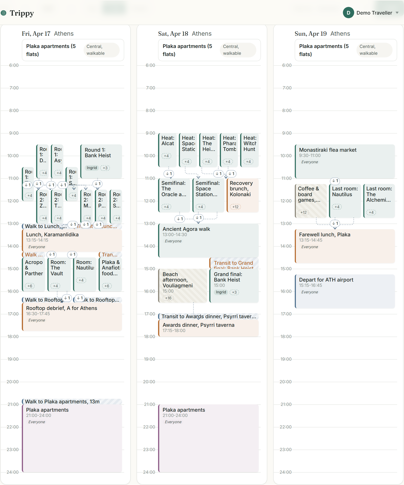
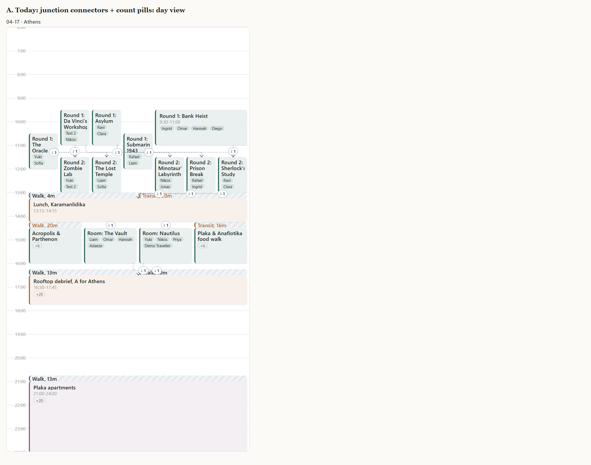
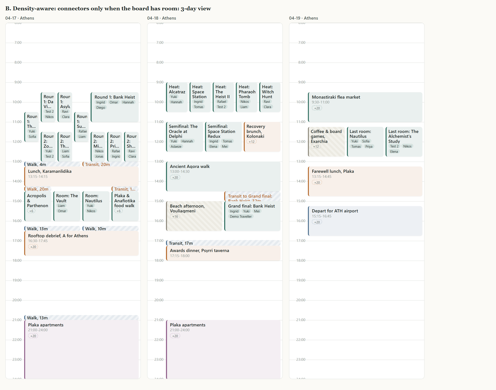
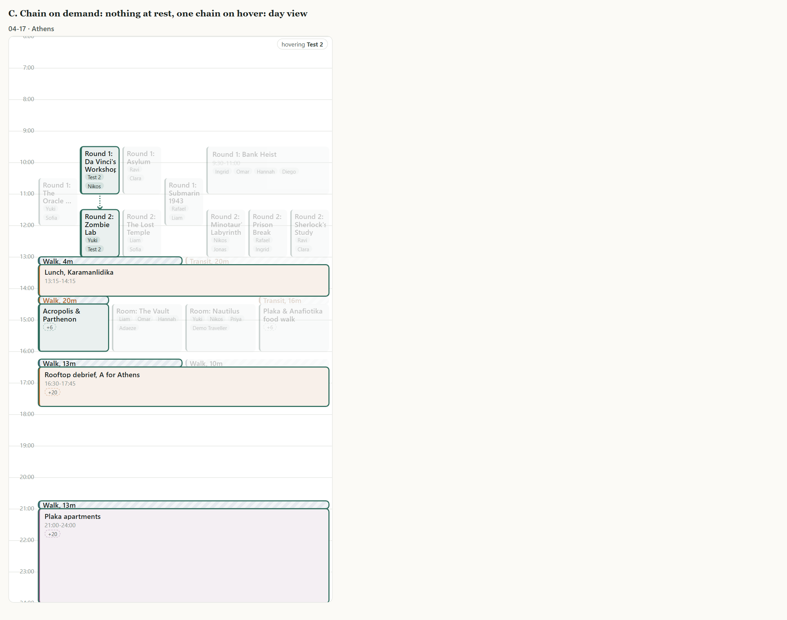
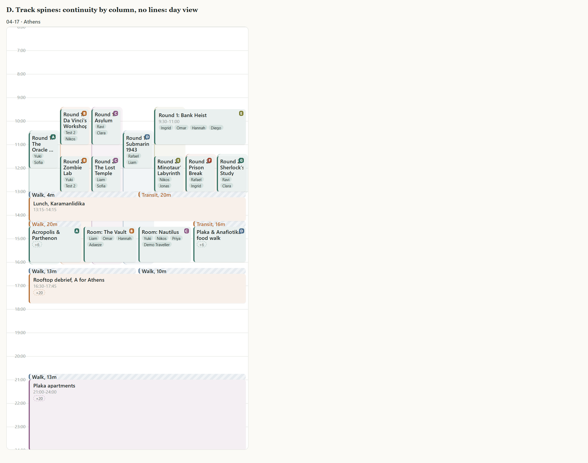
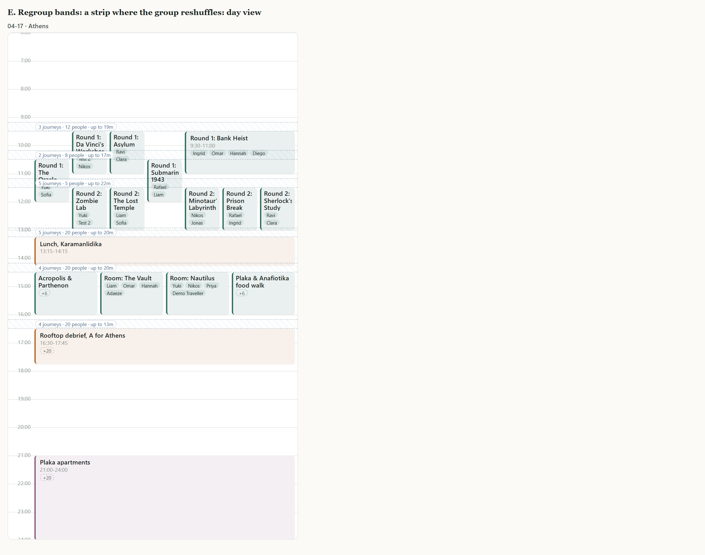
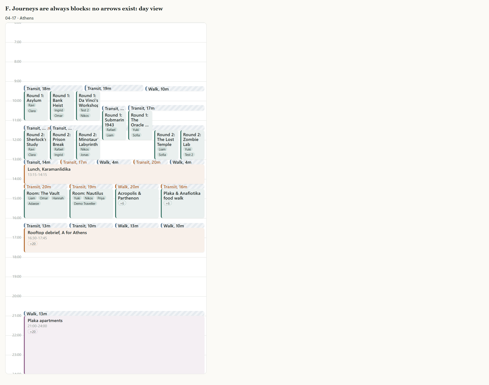
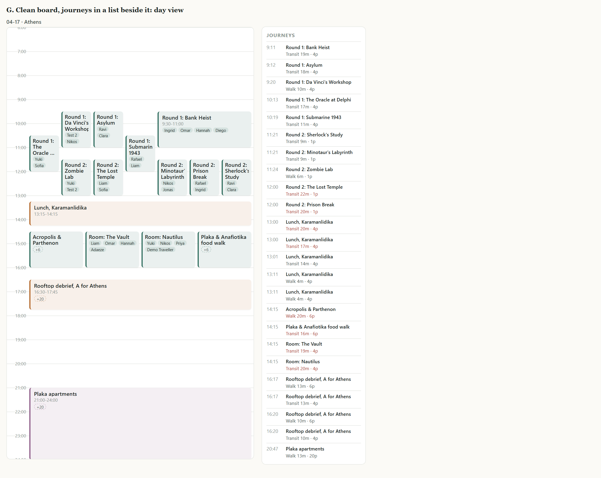
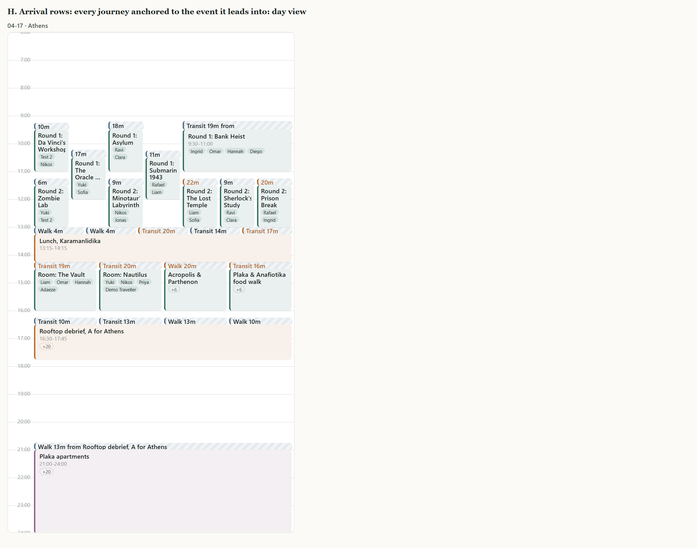
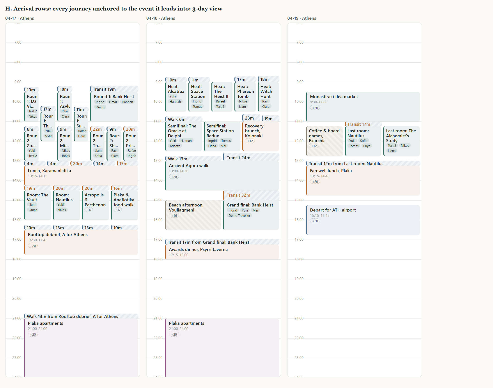

# Drawing travel on the schedule board: options

> **The conclusion here is superseded by `travel-decision.md`**, which argues the
> recommended option in detail against later measurements. This document remains
> the record of what was considered and why the rest was rejected. Note that the
> fan objection raised against option H below was measured afterwards and turned
> out to be wrong.

Written 12 Sep 2026, after you flagged that the 3-day view "gets really busy".

Everything below is measured or rendered from the real Athens trip, not sketched.
The previews go through the real layout engine (`layoutDay` / `layoutBoard`) with
the real data, the real CSS and the real column widths, so they are comparable to
each other and to what is on screen today.

Previews are in `docs/notes/travel/`. Each option has a `-day` and a `-3day`
image. Open `zz-preview/index.html` to see them all in one scroll.

---

## 1. The problem, measured

Friday 17 April is the worst day in the trip: 17 events, 24 journeys, the group
splitting five ways twice and rejoining twice.

| Day | Events | Journeys | Journeys drawn as blocks | Connectors | Count pills | **Total marks** |
|---|---|---|---|---|---|---|
| Fri 17 | 17 | 24 | 7 | 16 | 12 | **35** |
| Sat 18 | 13 | 11 | 2 | 9 | 5 | **16** |
| Sun 19 | 6 | 2 | 0 | 4 | 2 | **6** |

Thirty-five marks on one day, and only 7 of them say anything useful. A
connector says "someone moved". A pill says "someone moved, and there is a
journey behind this you can click". Neither says how long, by what mode, or
whether it fits. Only the block does that.

So the board spends most of its ink on its least informative mark. That is the
whole problem, and it is worse in the 3-day view only because the columns are
1/3 as wide: the pills stay the same size while the titles shrink to
"Rou 2: Z...".

### Why so few journeys become blocks

`layoutBoard` tries every journey as a block, then drops any whose middle does
not fall under both events it joins. On Friday that test rejects 17 of 24.

The reason is structural, not a tuning problem. A journey's block is placed by
the same packer that places events, and the packer puts it wherever a column
happens to be free. It has no reason to put it under either of its endpoints.
So the board asks a question ("did it land under both?") that it never tried to
make true.

That is the insight the rest of this report turns on.

---

## 2. The options

### A. Today: junction connectors and count pills

Right-angle dotted connectors over the blocks, one shared channel and one
arrowhead per arrival, a `↓N` pill wherever a journey has no block.

**Pros.** No information is lost. Every journey is reachable. The junction
routing does genuinely read better than the old curves on a simple rejoin.

**Cons.** 35 marks on the dense day. The pills line up in a horizontal row at
each regroup, which reads as a row of buttons rather than as movement. On the
3-day view they are the loudest thing on the board while carrying the least.
The dotted channel runs the full width of the day, so a five-way split draws one
long line across every block between.

**Verdict.** The best version of the wrong idea.

---

### B. Density-aware: connectors only when the board has room

Identical to today in the day view. In the 3-day view, drop connectors and pills
entirely and show blocks only.

**Pros.** One afternoon of work, no new concepts, fixes exactly the view you
complained about. Defensible on its own terms: the 3-day view answers "what is
the shape of the week", not "who walked where at 11:30".

**Cons.** Treats the symptom. The day view still carries 35 marks. It also means
a journey with no block is completely unreachable in the 3-day view, so the view
silently has fewer affordances than it looks like it has.

**Verdict.** Worth doing regardless of what else we choose, but not an answer.

---

### C. Chain on demand

Nothing at rest. Hovering a block, or picking someone in "View as", lights that
person's chain and dims the rest. The preview shows Test 2 hovered.

**Pros.** Removes all resting clutter at any density. It answers "what is my
day" better than anything else here: the whole path from Da Vinci's Workshop to
the Plaka apartments reads in one glance, and it needs exactly one connector
because the rest of the chain is already vertically aligned. It scales to a
50-person trip.

**Cons.** Invisible until you interact, so the board no longer shows the group
splitting and rejoining at a glance, which is the thing the columns exist for.
Nothing to hover on a touch screen. Useless when printed or screenshotted into
the group chat.

**Verdict.** A very strong complement, a poor replacement. Worth building
whatever else we do, and it composes with every other option here.

---

### D. Track spines

Give each column a tinted spine and a letter, so continuity is carried by
position rather than by lines.

**Pros.** Zero lines. The letters give people something to say out loud
("you're on track C after lunch").

**Cons.** It is a lie with the current data. Columns are not crews. Track B is
Da Vinci's Workshop in the morning and Zombie Lab after, and those two have one
person in common out of four. The packer assigns columns to minimise crossings,
not to keep groups together, so a stable-looking spine would imply a continuity
that is not there. Making it honest means authored tracks in the data model,
which is a product decision, not a drawing one. Colour is also already spent on
event type.

**Verdict.** No, unless we decide trips should have authored tracks. The
original product sketch did mention organiser-created tracks, so this is worth
holding onto as a separate question.

---

### E. Regroup bands

A full-width horizontal strip wherever two or more journeys land together,
summarising them: "5 journeys, 20 people, up to 20m".

**Pros.** Predictable position, no crossing anything, scales to any number of
people. Reads as "the group reshuffles here", which is true and useful.

**Cons.** The preview shows the flaw plainly. Journeys do not line up on tidy
row boundaries, so bands land in the middle of blocks: the 10:35 band slices
through "Round 1: Da Vinci's Workshop". Fixing that means snapping bands to
gaps, which means moving events, which we are not going to do. It also loses
which sub-group went where, and it adds a mark on a day that already has too
many.

**Verdict.** No.

---

### F. Journeys are always blocks

Stop testing whether a journey can be a block. Give every journey to the packer
as a first-class item and let it place them all. No connectors, no pills, ever.

**Pros.** The screenshot speaks for itself: 24 marks instead of 35, and every
one of them is the informative kind. The day reads as strict alternating rows,
travel then event then travel then event. Crucially, **the column count does not
increase**: 7 columns before, 7 after, on every day measured. Journeys pack into
gaps the day already had.

**Cons.** The packer still has no reason to put a bar under its own endpoints.
Measured: 10 of 24 bars sit under neither endpoint, and 6 of 24 sit somewhere
other than above the event they lead into. A bar above a column whose event it
has nothing to do with is worse than no bar. Also 19 of 24 journeys are under 24
minutes, so most bars are 15px slivers.

**Verdict.** Right instinct, wrong mechanism. Which leads to:

---

### G. Clean board, journeys in a list

Nothing on the board at all. A "Journeys" panel beside it, in time order.

**Pros.** The cleanest board of any option. Everything is reachable, sortable,
searchable and accessible without hover. Scales infinitely.

**Cons.** 24 rows on Friday, and the reader has to match names by eye between
two places. It also wants the right-hand slot the map currently occupies, and
the map is more valuable. It answers "list the journeys" rather than "show me
the day".

**Verdict.** No as a primary, but the panel would be a good addition to the day
view if we ever have the room.

---

### H. Arrival rows (recommended)

Every journey is a block, and it is **anchored to the event it leads into**
rather than placed by the packer. It takes that event's column and sits directly
on top of it. Where several journeys arrive at the same event they share that
event's width, left to right in the order of the columns they came from.

Journeys are no longer packed at all, so events get laid out exactly as if
journeys did not exist, which is the widest they can ever be.

**Why it works.** A journey's meaning is "this is how these people get into this
event". Anchoring it to the arrival makes the drawing say what the journey is,
and it makes the containment question unanswerable rather than merely
usually-true: a bar is under its arrival by construction, so there is nothing
left for a connector to explain.

The rejoin case, which is where today's board is worst, becomes the case it
draws best. Five journeys into lunch is five bars fanning across the lunch
block: a funnel, in one glance, with no lines.

**The one real objection, and why it does not bite.** A fan of five bars leaves
each one too narrow to name where it came from. But fans are rare:

| Day | Arrivals with a journey | Fan of 1 | Fan of 2 | Fan of 4+ |
|---|---|---|---|---|
| Fri 17 | 17 | 15 | 0 | 2 |
| Sat 18 | 9 | 7 | 2 | 0 |
| Sun 19 | 2 | 2 | 0 | 0 |

On the worst day, 15 of 17 arrivals have exactly one journey, so the bar gets
the event's full width and reads "Walk 13m from Rooftop debrief, A for Athens"
in full. The two fans are the two moments the whole group comes back together,
and there the fan shape is the message. Ordering the fan by origin column keeps
the crossing information that the connectors used to carry, positionally, for
free.

**Pros.** No connectors, no pills, no arrowheads, nothing overlapping anything.
Every mark carries mode, duration, how much of the gap it eats, and the "does
not fit" warning. Events get their maximum width, which is worth real pixels in
the 3-day view. Deterministic, so no relayout churn when a journey changes. Far
less code: `flowArrows`, `connector`, the channel logic, the pill collision
logic and the stranded-leg bookkeeping all go away, and `layoutBoard`'s
multi-pass demotion loop goes with them.

**Cons.** A journey whose people scatter to several later events is drawn once
per arrival, so a single walk can appear as two bars. Pure people-flows with no
journey behind them stop being drawn at all. And the "where did this come from"
answer moves into the label and the dialog rather than being traced by eye.

**Verdict.** This is what I would build.

---

## 3. Recommendation

**Build H, and add C on top of it.**

H gives the resting board its structure back: rows of travel above rows of
events, no lines anywhere, and every mark worth its ink. C gives the reader the
one thing H genuinely cannot show, "trace this person through the day", at the
moment they ask for it and not before.

That pairing covers both questions the board gets asked. "What is the shape of
this day" is answered by the resting layout. "What is my day" is answered by
hovering. Neither needs an arrow.

Suggested order:

1. H behind the existing board. It is mostly deletion: anchor legs to arrivals,
   drop the leg items from the packer, delete the connector system.
2. B falls out for free: with no connectors there is nothing to suppress, and
   the 3-day view improves on its own.
3. C afterwards, as a separate change, since it is additive and independently
   useful.

If you would rather not commit to the bigger change tonight, B alone is a
one-afternoon fix that makes the view you complained about materially better,
and it does not block H later.

## 4. Open questions for you

- **Authored tracks.** D is only dishonest because columns are derived. If trips
  are supposed to have organiser-named tracks, that changes this whole area and
  is worth settling first.
- **Fan labels.** In a fan of five, do you want the origin abbreviated onto the
  bar, or is the tooltip and dialog enough?
- **Double-drawn journeys.** When a group splits after one event, H draws the
  same departure once per arrival. I think that is correct (they are different
  journeys to different places) but it is worth a look on a real day.

## 5. Notes

- Numbers and previews regenerate with `npx tsx zz-preview.mts` then
  `node zz-cap.cjs`. Those two files, plus `zz-data.json` / `zz-dom.json`
  (dumped from the running API) and the `zz-preview/` output, are left in the
  working tree untracked so you can iterate on them. Delete them when this is
  settled.
- The two connector defects I found while measuring are already fixed on the
  board: six connectors were drawing as flat lines along the seam between block
  rows with an arrowhead sitting on it, and count pills could land 13px apart
  and overlap. Those fixes stand whatever we decide here.
- Unrelated, but noticed while reading the payload: there is a crew called
  "ZZ Probe crew" in `data/app.db`. It is not mine and I have not touched it,
  but it looks like a leftover probe fixture from another session.
